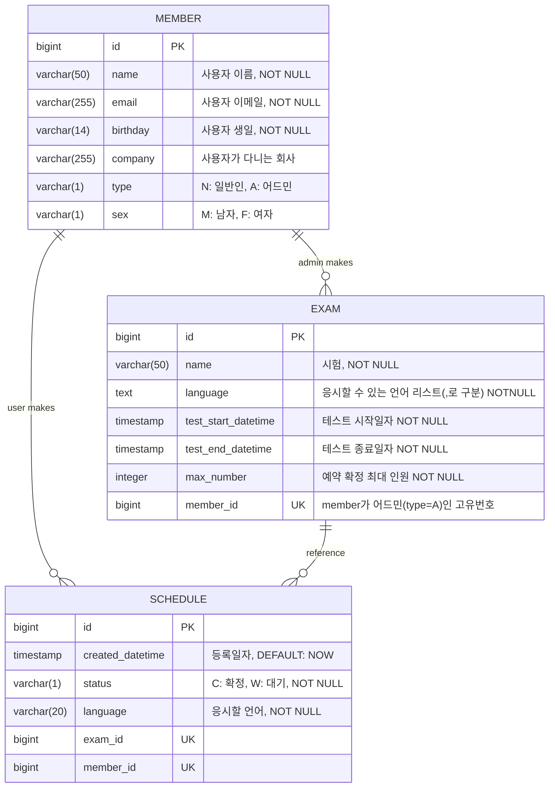

# 프로젝트 개요

프로그래머스가 운영하는 온라인 시험 플랫폼에서 기업 고객이 채용 시험 일정을 효율적으로 예약할 수 있는 시스템을 구축해야 합니다. 이 시스템은 고객과 어드민이 각각의 필요에 맞게 시험 일정 예약을 처리할 수 있도록 해야 합니다.

#### 예약 조회 및 신청

* 고객은 예약 신청이 가능한 시간과 인원을 알 수 있습니다.

* 예약은 시험 시작 3일 전까지 신청 가능하며, 동 시간대에 최대 5만명까지 예약할 수있습니다. 
  * 이때, 확정되지 않은 예약은 5만명의 제한에 포함되지 않습니다.

* 예약에는 시험 일정과 응시 인원이 포함되어야 합니다.
  * 예를 들어, 4월 15일 14시부터 16시까지 이미 3만 명의 예약이 확정되어 있을 경우, 예상 응시 인원이 2만명 이하인 추가 예약 신청이 가능합니다.

* 고객은 본인이 등록한 예약만 조회할 수 있습니다.
* 어드민은 고객이 등록한 모든 예약을 조회할 수 있습니다.

#### 예약 수정 및 확정

* 예약 확정: 고객의 예약 신청후, 어드민이 이를 확인하고 확정을 통해 예약이 최종적으로 시험 운영 일정에 반영됩니다. 확정되지 않은 예약은 최대 인원 수 계산에 포함되지 않습니다.
* 고객은 예약 확정 전에 본인 예약을 수정할 수 있습니다.
* 어드민은 모든 고객의 예약을 확정할 수 있습니다.
* 어드민은 고객 예약을 수정할 수 있습니다.

#### 예약 삭제

* 고객은 확정 전에 본인 예약을 삭제할 수 있습니다.
* 어드민은 모든 고객의 예약을 삭제할 수 있습니다.

#### 제출

* 완성된 소스 코드를 포함한 Github Repository 링크

* 작성된 코드를 로컬 환경에서 실행해보기 위한 환경 설정 및 실행 방법

* API 문서

#### 평가 기준

* 코드의 직관성 및 가독성

* 요구 사항의 완전성 및 정확성

* 설계 및 구현의 효율성

# 프로젝트 환경

#### 개발환경

* 개발환경: iMac M3
* 개발 IDE: PyCharm 
* 파이썬: 3.10.1
* 장고(Django) 버전: 5.1.0
* DB: PostgreSQL 14v
* swagger 접속 링크: http://localhost:8000/swagger/

## DB 환경설정

### (1) PostgreSQL에 접속

```bash
$ psql -U postgres
```

* `postgres`는 PostgreSQL의 슈퍼유저입니다. 비밀번호 입력 시 PostgreSQL에 접속할 수 있습니다.

### (2) 데이터 베이스 및 사용자 생성

만약 다른 데이터베이스 및 사용자를 사용하고 싶다면 django프로젝트 -> setting.py -> `DATABASE` 옵션을 변경해야 합니다.

#### 데이터 베이스 생성

```postgresql
CREATE DATABASE programmers
```

#### 사용자 생성

```postgresql
CREATE USER dbuser WITH PASSWORD 'dbuser'
```

### (3) 권한 부여

```postgresql
GRANT ALL PRIVILEGES ON DATABASE programmers TO dbuser;
```


## ERD



