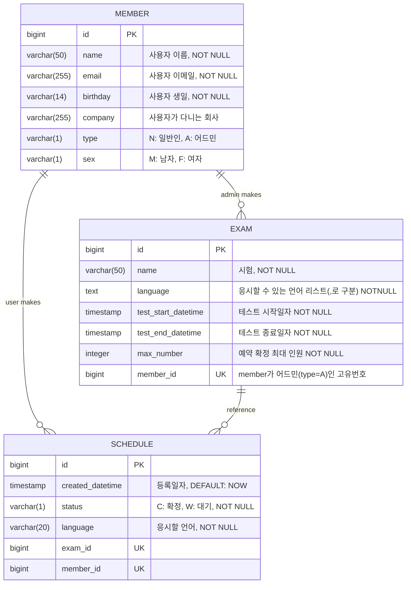

# 프로젝트 환경

#### 개발환경

* 개발환경: iMac M3
* 개발 IDE: PyCharm 
* 파이썬: 3.10.1
* 장고(Django) 버전: 5.1.0
* DB: PostgreSQL 14v
* swagger 접속 링크: http://localhost:8000/swagger/

## 프로젝트 환경 설정

### DB 환경설정

#### (1) PostgreSQL에 접속

```bash
$ psql -U postgres
```

* `postgres`는 PostgreSQL의 슈퍼유저입니다. 비밀번호 입력 시 PostgreSQL에 접속할 수 있습니다.

#### (2) 데이터 베이스 및 사용자 생성

만약 다른 데이터베이스 및 사용자를 사용하고 싶다면 django프로젝트 -> setting.py -> `DATABASE` 옵션을 변경해야 합니다.

**데이터베이스 생성**

```postgresql
CREATE DATABASE programmers
```

**사용자 생성**

```postgresql
CREATE USER dbuser WITH PASSWORD 'dbuser'
```

**권한 부여**

```postgresql
GRANT ALL PRIVILEGES ON DATABASE programmers TO dbuser;
```

### 프로젝트 환경 설정

#### (1) git downloads

* <> Code버튼을 누른 후 HTTPS를 눌러 Download ZIP을 누릅니다.
* 해당 프로젝트를 실행할 폴더를 생성합니다.

#### (2) 필요 패키지 다운로드

```bash
$ pip install django
$ pip install djangorestframework
$ pip install drf-yasg
$ pip install psycopg2-binary
$ pip install PyJWT
```

#### (3) 가상환경 설정

프로젝트 디렉터리로 이동한 후 가상환경을 설정합니다.

```bash
$ cd your-repo
$ python -m venv venv
$ source venv/Scripts/activate
```

#### (4) 데이터 베이스 마이그레이션

데이터베이스를 설정하기 위해 마이그레이션을 적용합니다.

```bash
$ python manage.py makemigrations myapp
$ python manage.py migrate myapp
```

#### (5) Django 개발 서버 실행

```bash
$ python manage.py runserver
```

## ERD


### 주의사항
유저 API는 유저(type=N)으로 만든 토큰으로 실행해야 합니다, 반대로 어드민 API는 유저(type=A)로 만든 토큰으로 실행해야 합니다. common는 토큰없이 실행할 수 있습니다.
